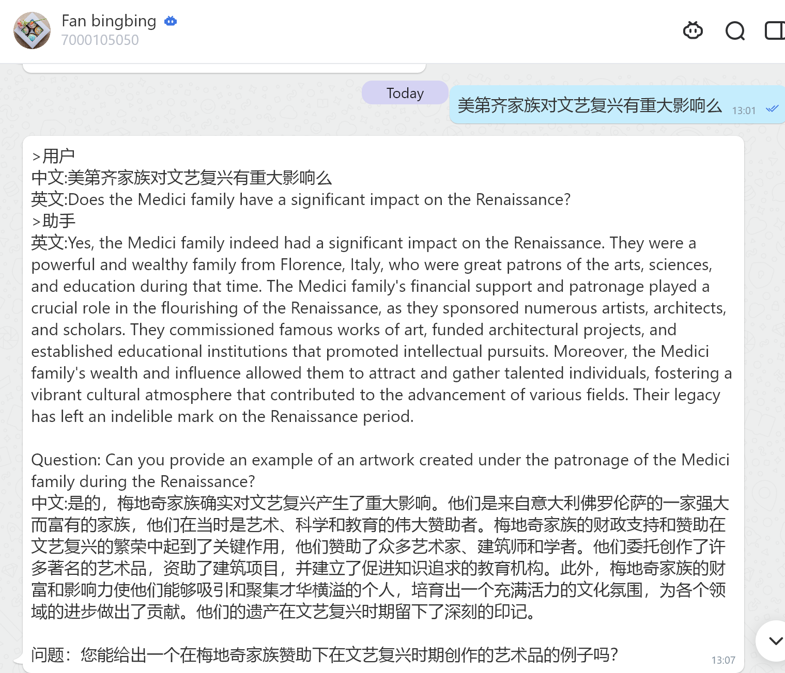

# 进阶学习——英语小助手项目练习篇

#### 1、沉浸式学习

完成自学编程作业只是踏出了第一步，为了持续打造手艺，参加项目是最好的理解代码的方式。虽然我一开始看到“英语小助手”这个项目有16个视频，是被吓退的。潜意识反应就是这太复杂了，我自己不可能完成通关这个项目。但是可能因为自己是个记单词困难户，什么词根词缀都试过，单词书至少五本以上，记忆效果却不明显，所以还是抱着有GPT加持的希望，提升一下自己的词汇量。
于是带着好奇心驱使自己跟着视频练习起来，每天大约跟着做一至两小时，遇到卡点也情绪稳定，告诉自己，卡点到了，可以喝水，健身，休息睡觉。有问题及时向mumu请教，也跟着其他小伙伴一起组团打怪，互相鼓励，最终坚持到了通关。

#### 2、学会整理思路

我们跟着视频学习，始终要记住小助手要实现的三个功能：
1.能调用gpt开启对话；
2.能实现艾宾浩斯曲线背单词；
3.能识别语音输入。
明确了自己的需求，就在遇到问题的时候，不管向谁来提问，都更容易有针对性，能更快的找到解决方法。
在第一和第二个需求的实现过程中，可能对小白的理解难度更大，我也把这一段的代码放到了github里共享，希望能给新手做一个参照，坚持学下来会有不一样的收获。有的时候照着视频敲，仍然会出一些标点小错误，有参照的代码更容易快速的识别这样的问题。
https://github.com/takk2050/AMANDA/tree/main
这是完成到视频7的代码链接，实现了调用GPT来开启对话的功能。

#### 3、每天使用它

我每天都在使用英语小助手来帮我学习新的单词，为了提高写作时能够顺利的想到这个词汇，我根据自己的需求改进了一下gpt的提示词prompt：

First, if the question is not in the form of a sentence or consists of separate words, please use the basic vocabulary to provide close synonyms for the word. Then, help by giving example sentences for the words and generate a sentence with the question to initiate the conversation. I would like you to act as a spoken English teacher and help me improve. I will speak to you in English, and you can reply in English to help me practice my spoken English. Please limit your reply to 150 words. I want you to strictly correct any grammar mistakes, typos, and factual errors. Please also ask me a question in your reply.

这样的话，在每次返回的新词解释中，就出现了该词的同义英文，也就是各个英语老师都建议的“要使用英英字典来学英语”就轻松实现了。不论使用什么字典，什么方法，能学好的路径其实只有一条：多练。

#### 4、在实践中理解现实的开发过程

在参加的共读活动中的书中，作者也这样总结到：应当先编写尽量简单、可行的代码，再在代码越来越复杂时重构。通关英语小助手项目，确实让我有了这样的体会。